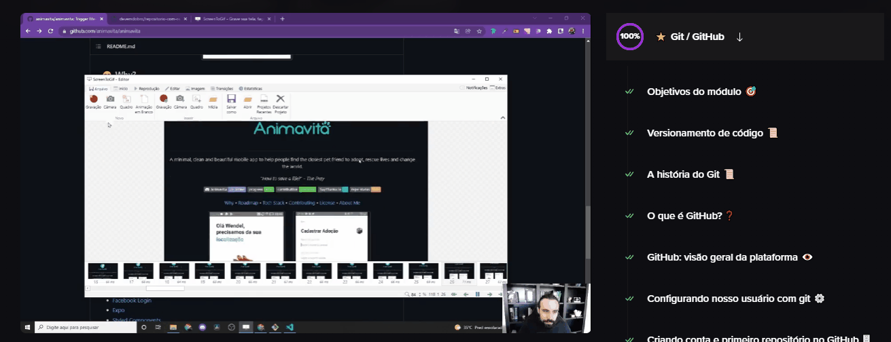

# Projeto com README
Um projeto de teste com um arquivo README 👌



## Tecnologias utilizadas
- HTML
- CSS
- JS
## Como Utilizar

Clone o projeto
```
git clone 
```

Acesse a pasta do projeto
```
cd repositorio
```

